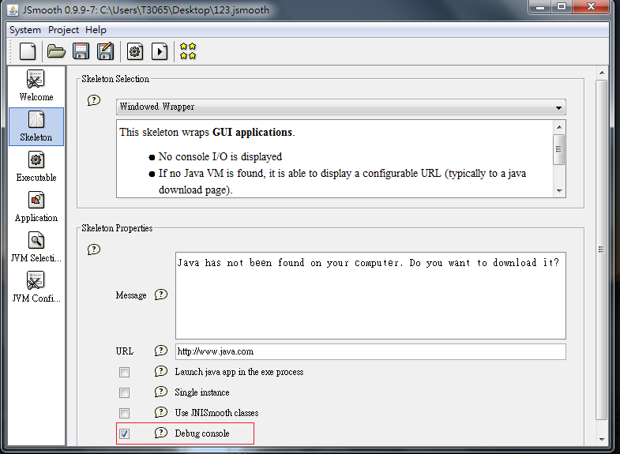
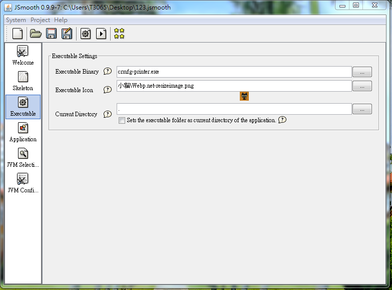
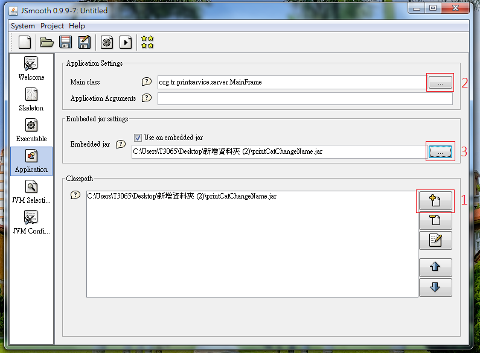
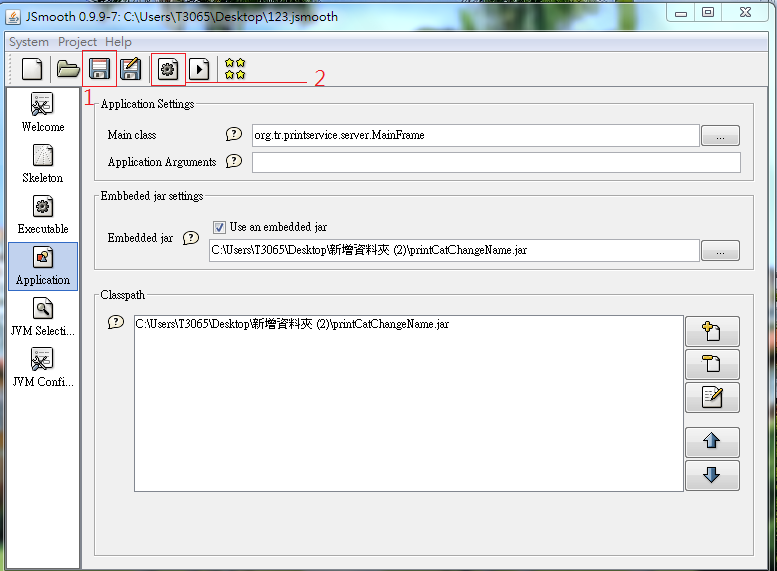
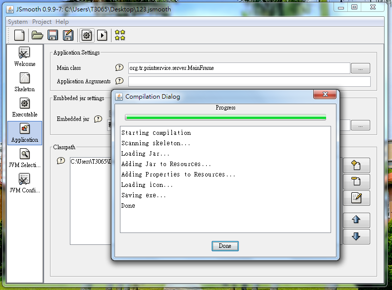
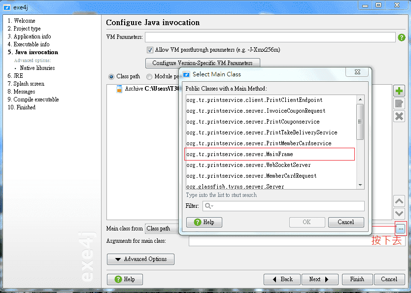
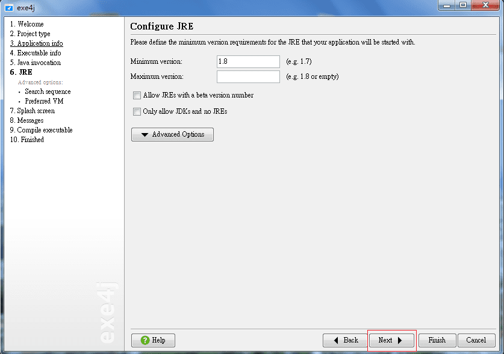
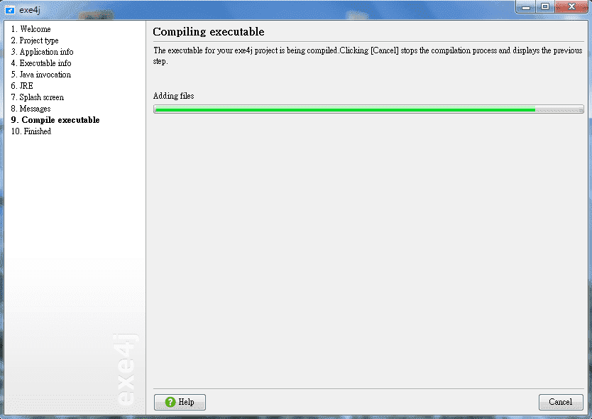
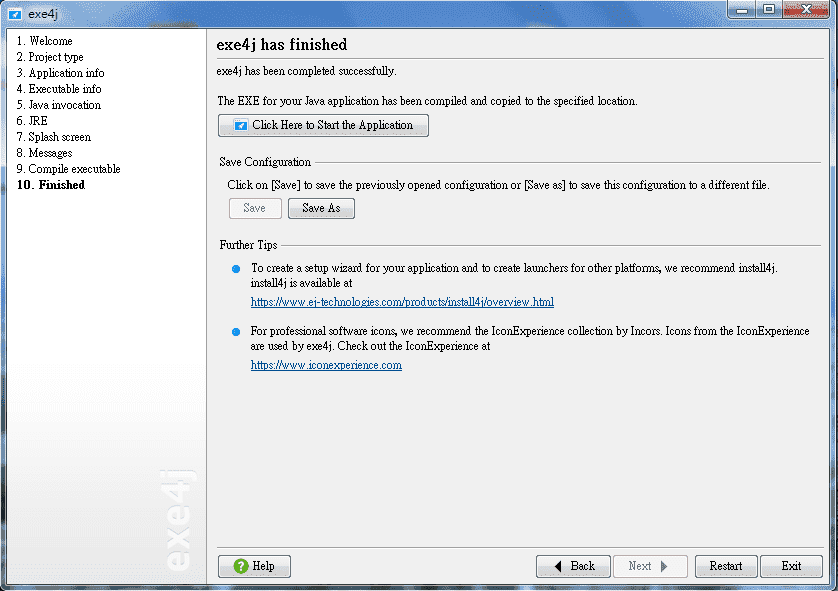

# CRMFG-PRINTER

## 事先安裝
1. OpenJDK 1.8[下載](https://developers.redhat.com/products/openjdk/download/)
2. GIT版控工具

## Eclipse封裝Jar檔
封裝前請先更改MainFrame.java裡面的版號

1. 在專案上，右鍵選擇Export

2. 選擇Java下面的Runnable JAR file

3. 選擇輸出.jar檔後的位置

## Jar檔轉成Exe檔
有許多軟體工具可以轉換成.exe檔的，在這邊我們使用Exe4j這個軟體[下載](https://www.ej-technologies.com/download/exe4j/files)
解壓縮安裝完軟體後，開始操作轉換
1. 執行軟體，在網路上尋找序號，輸入完序號後(沒輸入會在執行.exe時跳出惱人視窗)

2. 選擇"JAR in EXE"mode

3. 設定名字以及輸出.exe檔後的位置

4. 選擇輸出模式、設定輸出.exe檔名、設定icon(請用專案裡面的xiaomai.png，轉檔.ico)

5. 添加封裝的.jar

6. 選擇執行main的入口(MainFrame)

7. 輸入jdk版本

8. 接下來都下一步

9. 完成

