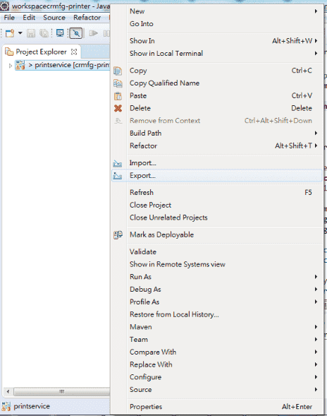
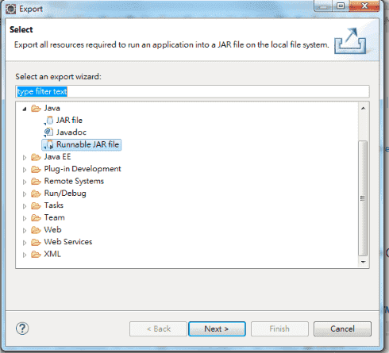
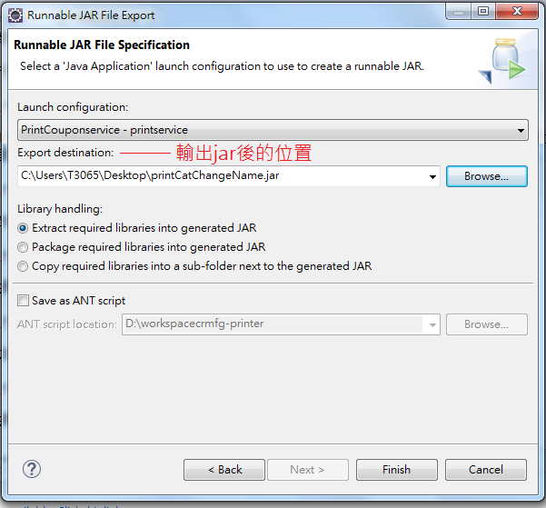

# CRMFG-PRINTER

## 事先安裝
1. OpenJDK 1.8[下載](https://developers.redhat.com/products/openjdk/download/)
2. GIT版控工具

## Eclipse封裝Jar檔
封裝前請先更改MainFrame.java裡面的版號

1. 在專案上，右鍵選擇Export

2. 選擇Java下面的Runnable JAR file

3. 選擇輸出.jar檔後的位置

## Jar檔轉成Exe檔
我們使用jsmooth這個軟體[下載](http://jsmooth.sourceforge.net/)
解壓縮安裝完軟體後，開始操作轉換

1. 執行軟體， 先選Skeleton，再從下拉選單Skeleton Selection，選擇Windowed Wrapper，Skeleton Properties可選擇在執行時是否要顯示console

2. 選Executable，Executable Binary設定exe的檔名(編譯完後的名字)、Executable Icon設定icon圖示(請用專案裡面的xiaomai.png)、Current Directory設定輸出.exe檔後的位置

3. 選Application(這邊請照著順序操作)，1選擇剛剛編譯好的jar檔，2選擇主要執行的.class檔，3也是選擇剛剛編譯好的jar檔

4.  一樣在Application這(這邊請照著順序操作)，1選擇存檔日後方便修改，2編譯成.exe檔

5. 完成

